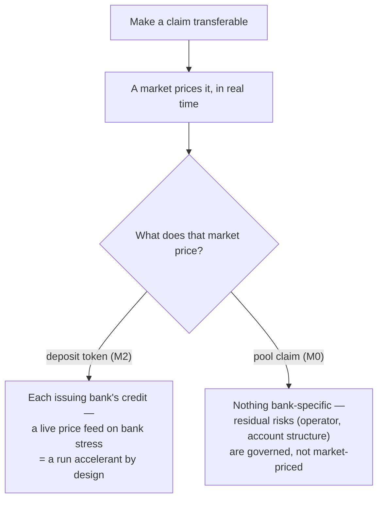
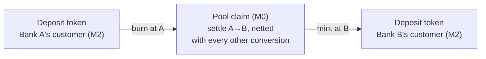
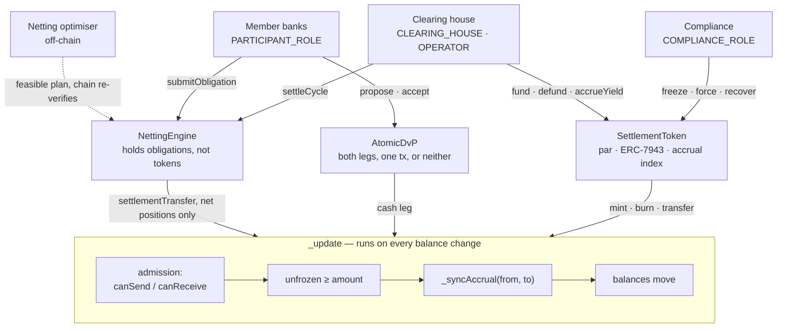

# Clearing-House Settlement Token — Reference Model

A reference implementation of a common interbank settlement asset of the kind a
clearing utility (e.g. a TCH-style operator) would issue: a **par-valued,
permissioned token** with a **separate yield-accrual index**, an **obligation
netting engine**, and **atomic delivery-versus-payment** — plus the off-chain
netting optimiser and an economics simulator that measures, rather than asserts,
what the design is worth.

Self-contained: no proprietary dependencies, no external services. Solidity via
Foundry, Go with a pure-stdlib module.

---

## The thesis

A transferable claim gets a market; a market prices the claim in real time. So
**which claim you make transferable decides where run risk lives**:

- **Transferable deposit tokens (M2)** give every issuing bank stablecoin-like
  run dynamics. The moment Bank C's token prints 98.4¢ in stress, everyone sees
  it and everyone exits first — a live price feed on each bank's credit is a run
  accelerant by design.
- **A transferable pool claim (M0)** has no single-bank credit to run on. A
  market in it prices nothing bank-specific; the residual risks — the operator
  and the account structure — are governed, not market-priced.



So the settlement tier should be the **transferable** one and the deposit tier
the **constrained** one — the opposite of where the industry is currently
investing. This repo implements the transferable core that thesis calls for.

## The bar it must clear

Instant, final, 24×7 settlement in central-bank money already exists: RTP has
settled through a prefunded joint account at the Federal Reserve Bank of New
York since 2017 — an account on which **the Fed pays interest** (the live
precedent for this repo's accrual index). An "M0 network" pitched on speed or
finality is that rail with a token wrapper. Where the dollars actually move:

| Rail | Daily value | Payments/day | Avg payment | Cap |
|---|---:|---:|---:|---:|
| Fedwire | ~$4.7tn | ~836k | ~$5.6m | — |
| CHIPS | ~$2.0tn | ~566k | $3.4m | — |
| RTP | ~$5.5bn | ~1.5m | ≈$3.7k | $10m |

The instant rail carries ~0.3% of wholesale daily value and is structurally
capped out of it. The defensible surface for a token layer is therefore what a
rail cannot do: **payments above $10m, atomic DvP against tokenized assets,
obligation netting, conditional (escrowed) execution, and yield distributed to
the holder-of-record.** Those five capabilities are exactly what these
contracts implement.

## The three mechanisms this repo makes executable

**1. Par is preserved while economics travel with the token.**
Both market-standard yield mechanisms break a settlement asset: exchange-rate
accrual (ERC-4626-style) pushes the unit off par so units minted at different
times stop being fungible; rebasing changes balances underneath every contract
holding one. `SettlementToken` keeps the unit at exactly one dollar and tracks
yield in a separate per-unit index, synced on both sides of every transfer — so
income credits **whoever held the token during each period**, not the original
contributor, and yield **never mints** (units with no reserve behind them would
break the backing invariant `totalSupply == reservePool`). If the pool ends up
in a non-interest-bearing account, the index simply stops advancing — no
migration, no contract change.

**2. Netting is impossible if submitting a payment moves tokens.**
`burn → mint → fail if short` is gross settlement; its efficiency is 1:1 by
construction. `NettingEngine` holds **obligations, not tokens**: submission
moves nothing, cycles settle only net positions, and any participant can pull an
obligation out for immediate gross settlement (`forceGross`) at the cost of
funding it in full. Netting is a prefunded system's substitute for the daylight
credit that Fedwire provides and a token pool cannot.

**3. The chain does not trust the optimiser.**
Choosing which obligations to settle is a search problem and runs off-chain
(`internal/clearing`). Verifying the answer is a linear scan and runs on-chain:
`settleCycle` recomputes net positions from the discharged obligations and
rejects anything that does not follow from them. A compromised optimiser cannot
move value the obligations do not imply.

Mechanisms 2 and 3 in one trace:

```mermaid
sequenceDiagram
    participant A as Bank A
    participant NE as NettingEngine
    participant OPT as Off-chain optimiser
    participant OP as Operator
    participant TOK as SettlementToken
    A->>NE: submitObligation(id, payee, amount)
    Note over NE: nothing moves, obligation queued
    OPT->>OP: feasible net plan (a search problem)
    OP->>NE: settleCycle(cycleId, netPositions, discharged)
    Note over NE: recomputes the net set from the discharged obligations
    Note over NE: rejects unless it matches and sums to zero (a linear scan)
    NE->>TOK: settlementTransfer, debits first then credits
    Note over TOK: the full gate, freeze and accrual pipeline runs on every leg
```

## The role in a two-tier system: the conversion layer

M0 and M2 are complementary tiers, and the open question is whether movement
between them can get efficient enough that institutions keep deposit economics
with near-M0 finality. In that architecture an interbank transfer of edge money
is never a *transfer* at all — it is an atomic **burn at Bank A → settle A→B in
the pool claim → mint at Bank B**, so no interbank claim outlives a transaction
and bank credit never trades. Conversion flows are dense and offsetting, which
is precisely what the netting engine exploits. This repo's four components —
par token, accrual index, netting engine, atomic DvP — are the conversion
layer's mechanisms.



One atomic operation: the customer sees an instant payment, no interbank claim
outlives the transaction, and par between the banks' tokens holds by mechanism.

## Measured, not asserted

`go run ./cmd/clearing-operator` reproduces the economics (20 participants,
5,000 payments, skewed values):

- Netting cuts **turnover ~9×** ($17.6bn → $2.0bn moved for the same value
  settled) at batch cycle size 1,000; cycle size 1 measures exactly 1.0:1,
  which is the model checking itself against gross settlement.
- **Peak drawdown barely moves** ($343m → $335m): a net payer still funds its
  closing position. The netting ratio reduces intraday turnover, not
  end-of-day funding — quoting it otherwise would not survive a treasurer.
- On a $10bn pool at 4%, the pool either distributes **$32.9m per 30 days**
  through the accrual index or that sum is the participants' cost. The
  contracts are identical either way — and the live precedent favours
  distribution: a bank-owned joint settlement account at the Fed already earns
  master-account-equivalent interest (Board order, June 2023), paid to the
  account's owners. That order passes interest back by *funder*; a circulating
  claim needs it by *holder-of-record*, which is what the accrual index is.

## The shape of the code — three contracts, one choke point

Every value movement, from every contract, terminates on the token's single
`_update` pipeline. There is no second path — which is the auditability
argument in one picture.



## Layout

| Path | What it is |
|---|---|
| `contracts/src/SettlementToken.sol` | Par token, ERC-7943 (uRWA) gate/freeze/force, accrual index, key-loss recovery |
| `contracts/src/NettingEngine.sol` | Obligation queue, verified net-settlement cycles, gross escape hatch |
| `contracts/src/AtomicDvP.sol` | Same-ledger asset-vs-cash: both legs in one transaction, or neither |
| `contracts/test/` | 22 Foundry tests pinning the invariants, incl. two audit regressions |
| `internal/clearing/` | Multilateral netting + gridlock resolution (feasible, deterministic plans) and the economics simulation |
| `cmd/clearing-operator/` | Prints the economics tables: efficiency and funding vs cycle size, accrual vs pool location |

## Run it

```bash
# Contracts (Foundry via Docker; or `forge test` if installed)
cd contracts && docker run --rm -v "$PWD":/w -w /w ghcr.io/foundry-rs/foundry:stable "forge test"

# Go: netting optimiser + simulation tests
go test ./...

# The economics tables
go run ./cmd/clearing-operator
```

Dependencies under `contracts/dependencies/` are soldeer-managed and not
committed; `forge soldeer install` restores them (pins in `foundry.toml`).

## Standards and interoperability position

Built as plain OpenZeppelin ERC-20 + AccessControl, implementing the
**ERC-7943 (uRWA)** fungible interface — gate, freeze, forced transfer — with
two mechanisms ported from **ERC-3643**: key-loss recovery (`recoverBalance`)
and partial freeze. ERC-3643's full identity stack (six mandatory contracts plus
an ONCHAINID per holder) is deliberately not adopted: a settlement asset has a
few dozen holders, each an admitted institution under a legal agreement — a
membership list, not a claims registry. Expect the *securities* leg of a DvP to
be ERC-3643; the `AtomicDvP` asset leg is plain `IERC20` so such tokens work
unchanged, and their compliance checks propagate (an ineligible buyer reverts
both legs).

Cross-chain, the preference order is a trust-minimisation ladder: **IBC
light-client channels first** (each chain verifies the other's consensus;
relayers can delay but never forge, and no attestation committee joins the
trust base), then venue synchronizers (Canton-style, when the counter-venue
mandates one), then attested messaging (Chainlink CRE-style), then HTLCs last.
Same-ledger DvP is the only unconditional rung; every cross-chain claim of
atomicity should name the trust assumption it stands on.

## Known limits, stated plainly

- **The obligation graph is public to chain participants** (payer, payee,
  amount). Deployable versions need commit-reveal, ZK netting, or a
  privacy-native venue. This gates any pilot.
- **No default waterfall.** Deferred settlement creates payee credit exposure
  between submit and cycle; a reverted cycle protects the ledger, not the payee
  who waited. Production needs net debit caps and loss-sharing rules.
- **Obligations do not expire**, and the operator can `forceGross` any queued
  obligation — needs TTLs and a payer-revocation window.
- **Plan-to-execution race:** balances can move between the optimiser's plan and
  `settleCycle`; the revert is atomic and safe, but production wants balance
  reservation.
- Gridlock resolution is a greedy heuristic (feasible and deterministic, not
  optimal). The simulator models random flow, not strategic queue management —
  batch cycles reach ~9:1 efficiency, not a CHIPS-like 29:1.
- Accrual is one-directional (no negative rates, no on-chain fees), and any
  contract that holds balances across time accrues yield to itself — forward
  entitlement or keep custody transient.
- **A 24×7 token redeems into banking-hours money**: `defund` promises fiat and
  Fedwire closes. Redemption windows or an intraday facility are a policy
  choice the contracts do not make.
