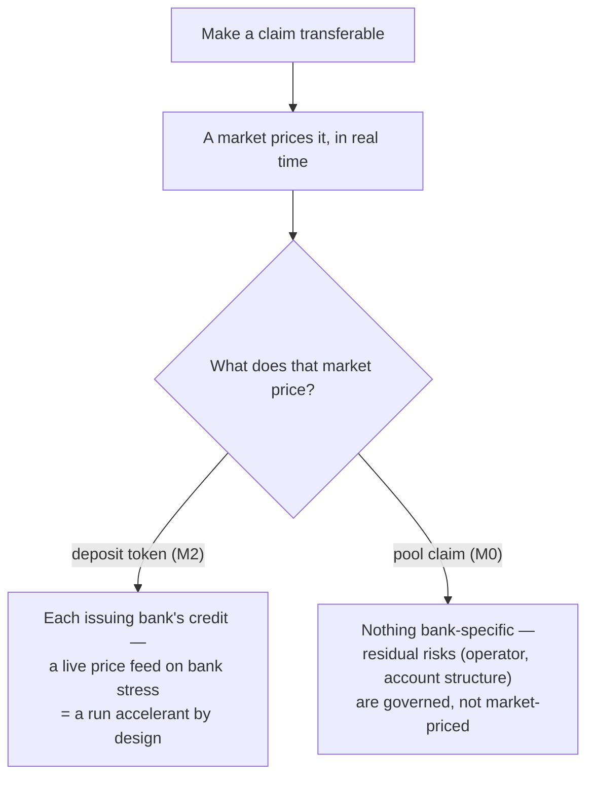
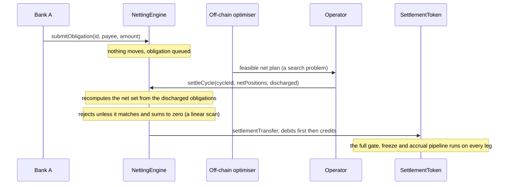
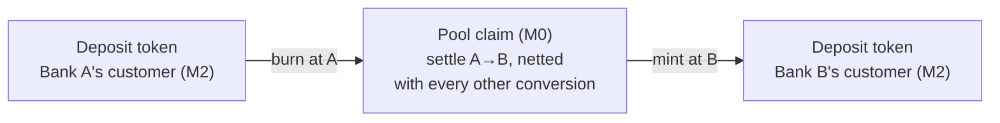
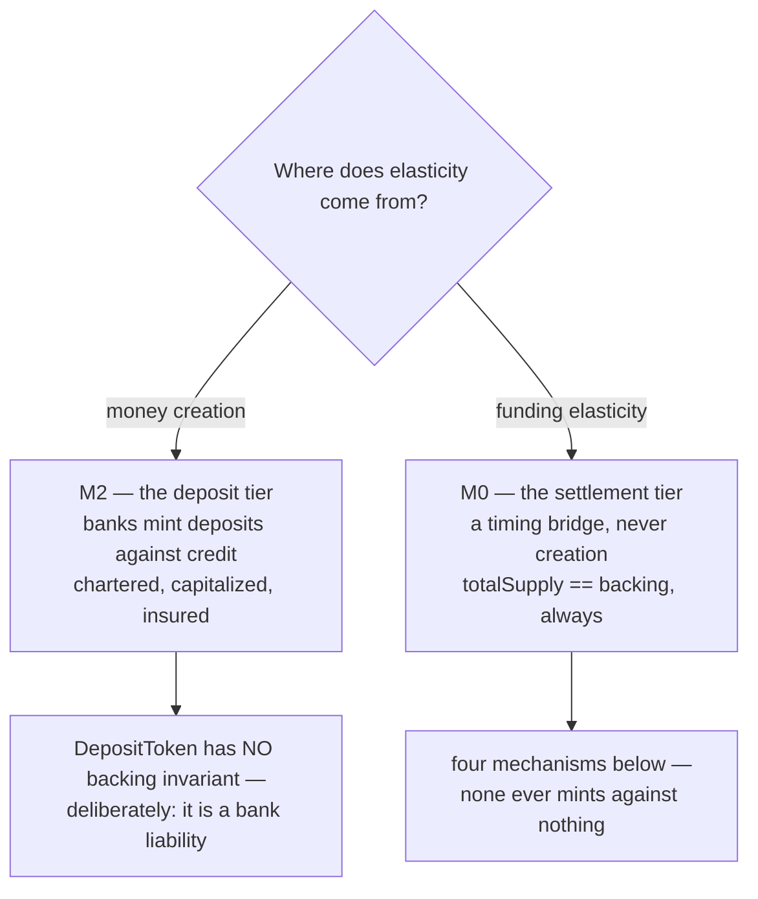
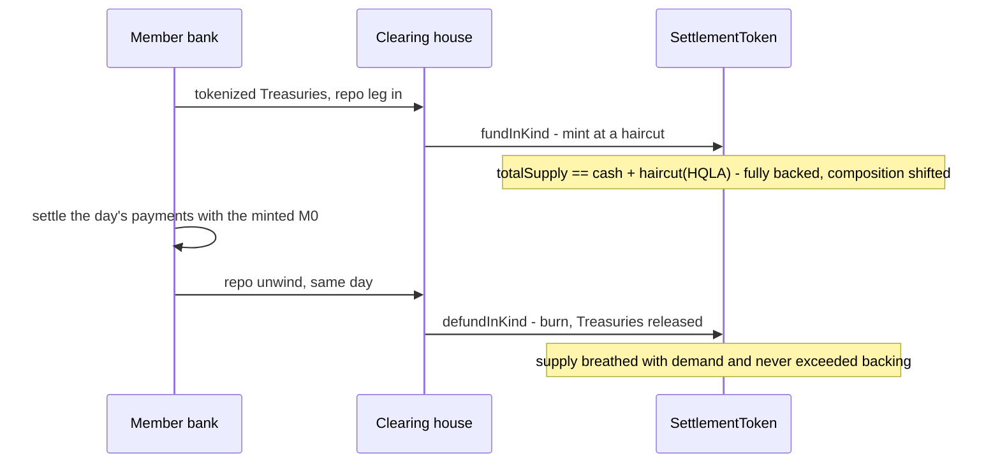
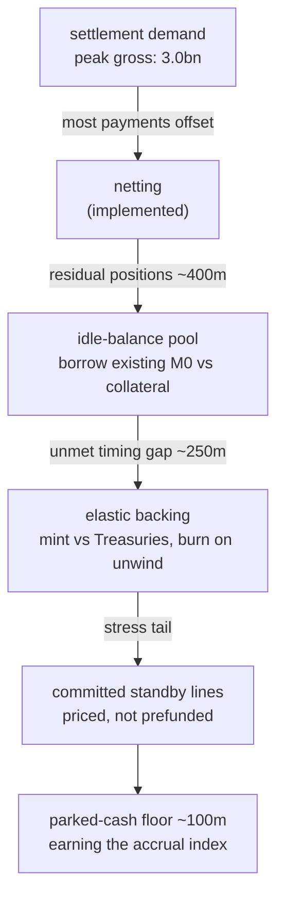
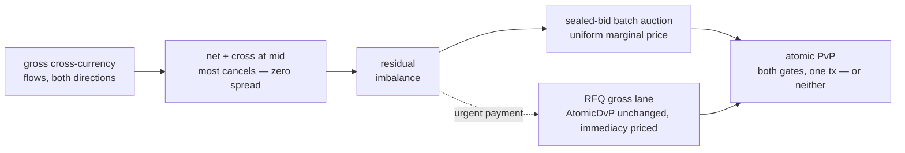
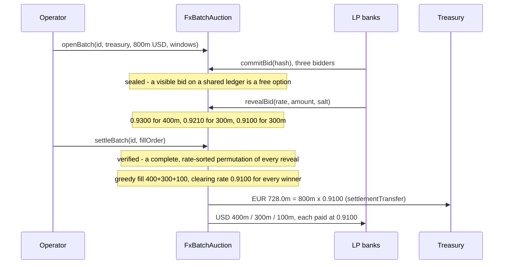
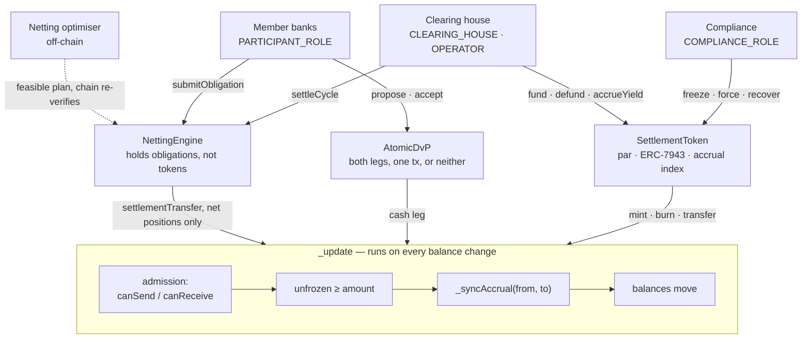

# Clearing-House Settlement Token — Reference Model

A reference implementation of a common interbank settlement asset of the kind a
clearing utility (e.g. a TCH-style operator) would issue: a **par-valued,
permissioned token** with a **separate yield-accrual index**, an **obligation
netting engine**, and **atomic delivery-versus-payment** — plus the off-chain
netting optimiser and an economics simulator that measures, rather than asserts,
what the design is worth.

Self-contained: no proprietary dependencies, no external services. Solidity via
Foundry, Go with a pure-stdlib module.

---

## The thesis

A transferable claim gets a market; a market prices the claim in real time. So
**which claim you make transferable decides where run risk lives**:

- **Transferable deposit tokens (M2)** give every issuing bank stablecoin-like
  run dynamics. The moment Bank C's token prints 98.4¢ in stress, everyone sees
  it and everyone exits first — a live price feed on each bank's credit is a run
  accelerant by design.
- **A transferable pool claim (M0)** has no single-bank credit to run on. A
  market in it prices nothing bank-specific; the residual risks — the operator
  and the account structure — are governed, not market-priced.



So the settlement tier should be the **transferable** one and the deposit tier
the **constrained** one — the opposite of where the industry is currently
investing. This repo implements the transferable core that thesis calls for.

## The bar it must clear

Instant, final, 24×7 settlement in central-bank money already exists: RTP has
settled through a prefunded joint account at the Federal Reserve Bank of New
York since 2017 — an account on which **the Fed pays interest** (the live
precedent for this repo's accrual index). An "M0 network" pitched on speed or
finality is that rail with a token wrapper. Where the dollars actually move:

| Rail | Daily value | Payments/day | Avg payment | Cap |
|---|---:|---:|---:|---:|
| Fedwire | ~$4.7tn | ~836k | ~$5.6m | — |
| CHIPS | ~$2.0tn | ~566k | $3.4m | — |
| RTP | ~$5.5bn | ~1.5m | ≈$3.7k | $10m |

The instant rail carries ~0.3% of wholesale daily value and is structurally
capped out of it. The defensible surface for a token layer is therefore what a
rail cannot do: **payments above $10m, atomic DvP against tokenized assets,
obligation netting, conditional (escrowed) execution, and yield distributed to
the holder-of-record.** Those five capabilities are exactly what these
contracts implement.

## The three mechanisms this repo makes executable

**1. Par is preserved while economics travel with the token.**
Both market-standard yield mechanisms break a settlement asset: exchange-rate
accrual (ERC-4626-style) pushes the unit off par so units minted at different
times stop being fungible; rebasing changes balances underneath every contract
holding one. `SettlementToken` keeps the unit at exactly one dollar and tracks
yield in a separate per-unit index, synced on both sides of every transfer — so
income credits **whoever held the token during each period**, not the original
contributor, and yield **never mints** (units with no reserve behind them would
break the backing invariant `totalSupply == reservePool`). If the pool ends up
in a non-interest-bearing account, the index simply stops advancing — no
migration, no contract change.

**2. Netting is impossible if submitting a payment moves tokens.**
`burn → mint → fail if short` is gross settlement; its efficiency is 1:1 by
construction. `NettingEngine` holds **obligations, not tokens**: submission
moves nothing, cycles settle only net positions, and any participant can pull an
obligation out for immediate gross settlement (`forceGross`) at the cost of
funding it in full. Netting is a prefunded system's substitute for the daylight
credit that Fedwire provides and a token pool cannot.

**3. The chain does not trust the optimiser.**
Choosing which obligations to settle is a search problem and runs off-chain
(`internal/clearing`). Verifying the answer is a linear scan and runs on-chain:
`settleCycle` recomputes net positions from the discharged obligations and
rejects anything that does not follow from them. A compromised optimiser cannot
move value the obligations do not imply.

Mechanisms 2 and 3 in one trace:



## The role in a two-tier system: the conversion layer

M0 and M2 are complementary tiers, and the open question is whether movement
between them can get efficient enough that institutions keep deposit economics
with near-M0 finality. In that architecture an interbank transfer of edge money
is never a *transfer* at all — it is an atomic **burn at Bank A → settle A→B in
the pool claim → mint at Bank B**, so no interbank claim outlives a transaction
and bank credit never trades. Conversion flows are dense and offsetting, which
is precisely what the netting engine exploits. This repo's four components —
par token, accrual index, netting engine, atomic DvP — are the conversion
layer's mechanisms.



One atomic operation: the customer sees an instant payment, no interbank claim
outlives the transaction, and par between the banks' tokens holds by mechanism.

That conversion layer is now executable. **`DepositToken`** is one bank's
tokenized deposit — minted against deposits taken, burned against
withdrawals, gated to that bank's own customers, paying deposit interest
through the same accrual-index mechanics at the bank's own rate.
Deliberately, it has **no backing invariant**: it is a chartered bank's
liability, backed by the bank's balance sheet — money creation lives at this
tier, where it is licensed, capitalized and insured, and nowhere else.
Interbank transfer is structurally impossible (each bank's token is its own
contract, gated to its own customers), so a cross-bank payment can only be a
conversion: **`ConversionBridge`** burns at Bank A, moves settlement money
A→B over the settlement path, and mints at Bank B — one transaction or none,
with every tier's gates binding on its own leg and **no rate parameter
anywhere on the path**. The bridge is deliberately dumb: if the sending
bank's settlement balance is short, the conversion reverts — funding that
leg is the elasticity stack's job (netting, then collateralized intraday
liquidity, then elastic backing), never the seam's.

## Elasticity: how a fully-backed system breathes

The strongest objection to a prefunded settlement tier is locked money: the
pool must be sized to **peak** gross demand, and every parked dollar above
usage is sterilized balance sheet. Today's system hides the cost — the Fed
prices collateralized daylight overdrafts at zero precisely so banks need not
hoard — and a token pool inherits none of that machinery.

The tempting fix is the wrong one. Making the settlement claim *fractional* —
claims exceeding backing — would make it run-prone by theorem: a demandable
par claim against assets that cannot all liquidate at par, with no deposit
insurance and no lender of last resort, is the Diamond–Dybvig setup with the
protective institutions deleted. It would relocate run risk to the core,
inverting the thesis this design stands on. The resolution is a distinction
the fractional framing hides:

> Fractional reserve bundles three things — credit intermediation, deposit
> creation, maturity transformation. A settlement system needs only a timing
> bridge. **Elasticity of funding, not elasticity of money.**

Money creation stays where it is chartered, capitalized and insured; the
settlement tier gets funding elasticity from mechanisms that never break its
backing invariant:



### The four mechanisms, in the order they absorb demand

**1. Netting** *(implemented — `NettingEngine` + `internal/clearing`).*
Obligations queue and offset; only residuals fund. Measured ~9:1 here at
batch cycles; the production ceiling is CHIPS-like 29:1. The single biggest
lever, and the reason the pool is sized to residuals rather than peaks.

**2. Idle-balance intermediation** *(design — the `IntradayLiquidityPool`
extension).* Cash-rich members deposit spare M0 single-sided; a short member
draws against tokenized collateral at a haircut, intraday, at a
utilization-curve rate, and repays from incoming flows. A payment may be
funded part own-balance, part draw — a daylight overdraft with a down
payment. Total M0 is conserved: the pool reallocates existing balances, so
this is the *intermediation* half of fractional reserve with the *creation*
half amputated. Its limit is honest: total draws ≤ pool deposits, so it
needs the next layer behind it.

**3. Elastic backing** *(design — `fundInKind`/`defundInKind` on the
token).* When the whole system is short, supply itself breathes — against
collateral, never against nothing. The clearing house takes tokenized
Treasuries in via atomic DvP repo, mints M0 at a haircut, and burns on the
same-day unwind. The backing invariant generalizes from
`totalSupply == reservePool` to `totalSupply == cash + haircut(HQLA)`:
composition varies intraday, full backing never lapses. This is the elastic-
currency answer — supply against collateral — not the fractional one, and
its operational precedent (intraday tokenized repo) already runs at hundreds
of billions per day in production systems.



**4. Committed standby liquidity** *(design — a registry and a fee
schedule).* Designated members sell committed intraday lines: standby fees
in calm, mandatory provision in stress. The tail is priced instead of
prefunded, and drawing a line carries no stigma because it exercises a
paid-for right.

### How the stack composes



Order of magnitude, the parked-cash requirement falls ~30× from naive
peak-prefunding — and the floor that remains is remunerated through the
accrual index, so even it is not dead weight. Two properties hold at every
layer: **no claim ever exists without backing behind it** (the run-proofness
of the core is never traded for liquidity), and **the conversion seam stays
dumb** (a short settlement leg reverts; elasticity operates behind the
bridge, never inside it).

The honest limit: no pool is a central bank. This stack compresses and
remunerates the need for liquidity; it does not manufacture a lender of last
resort, and nothing in it depends on being granted one.

## Cross-currency: PvP and the residual auction

The same mechanics extend across currencies. Two findings, both pinned by
tests:

**Gross PvP needs zero new code.** A second currency's settlement token is a
plain `IERC20`, so it rides `AtomicDvP`'s asset leg unchanged: both cash legs
settle in one transaction or neither (Herstatt risk is unconstructable, not
managed), and *both* jurisdictions' admission gates, freezes and accrual sync
run on their own legs — a cross-border payment passes both regulators' controls
atomically or does not move.

**Conversion pricing is `FxBatchAuction`.** Cross-currency flows should be
netted and crossed at a reference mid first; only the residual imbalance needs
a market. The auction sells that residual under three commitments:

- **The operator is auctioneer, never principal** — the contract quotes
  nothing and holds no inventory; it cannot lose money on markets, which is
  what keeps the utility credit-neutral.
- **Sealed bids, because the ledger is shared** — a visible bid is a free
  option to everyone else, so bids commit as hashes and reveal after the
  window closes; unrevealed bids lapse.
- **The operator proposes, the chain verifies** — `settleBatch` takes the
  operator's fill order but requires a complete, rate-sorted permutation of
  every revealed bid (the `settleCycle` trust split, transplanted), then fills
  greedily and clears **every winner at the marginal accepted rate**. Uniform
  pricing removes the incentive to shade and the reward for speed; a batch has
  no queue. Firm quotes need no last-look — a winning reveal settles
  atomically in the same transaction.

The waterfall — price as little as possible:



One batch end to end, with the numbers the tests pin:



Because each currency's pool runs its own accrual index at its own
policy-proximate rate, the index differential is the forward points — covered
interest parity by arithmetic — and an FX swap decomposes into a spot PvP plus
a scheduled reverse PvP, with the indices carrying the carry in between.

## Measured, not asserted

`go run ./cmd/clearing-operator` reproduces the economics (20 participants,
5,000 payments, skewed values):

- Netting cuts **turnover ~9×** ($17.6bn → $2.0bn moved for the same value
  settled) at batch cycle size 1,000; cycle size 1 measures exactly 1.0:1,
  which is the model checking itself against gross settlement.
- **Peak drawdown barely moves** ($343m → $335m): a net payer still funds its
  closing position. The netting ratio reduces intraday turnover, not
  end-of-day funding — quoting it otherwise would not survive a treasurer.
- On a $10bn pool at 4%, the pool either distributes **$32.9m per 30 days**
  through the accrual index or that sum is the participants' cost. The
  contracts are identical either way — and the live precedent favours
  distribution: a bank-owned joint settlement account at the Fed already earns
  master-account-equivalent interest (Board order, June 2023), paid to the
  account's owners. That order passes interest back by *funder*; a circulating
  claim needs it by *holder-of-record*, which is what the accrual index is.

## The shape of the code — three contracts, one choke point

Every value movement, from every contract, terminates on the token's single
`_update` pipeline. There is no second path — which is the auditability
argument in one picture.



## Layout

| Path | What it is |
|---|---|
| `contracts/src/SettlementToken.sol` | Par token, ERC-7943 (uRWA) gate/freeze/force, accrual index, key-loss recovery |
| `contracts/src/NettingEngine.sol` | Obligation queue, verified net-settlement cycles, gross escape hatch |
| `contracts/src/AtomicDvP.sol` | Same-ledger asset-vs-cash, both legs or neither; offers revoke unilaterally, bound trades cancel only bilaterally |
| `contracts/src/FxBatchAuction.sol` | Cross-currency residual auction: sealed bids, uniform price, operator-verified fill order, PvP settlement |
| `contracts/src/DepositToken.sol` | One bank's M2: deposits in/out, customer gates, bank compliance, deposit interest via the accrual index — no backing invariant, by design |
| `contracts/src/ConversionBridge.sol` | The two-tier seam: burn at A → settle A→B → mint at B, atomic, rate-free, triggered by the sending bank |
| `contracts/test/` | 49 Foundry tests pinning the invariants, incl. audit regressions for recovery, the efficiency metric, bound-trade cancellation and the conversion seam (mint answers only to the bridge) |
| `internal/clearing/` | Multilateral netting + gridlock resolution (feasible, deterministic plans) and the economics simulation |
| `cmd/clearing-operator/` | Prints the economics tables: efficiency and funding vs cycle size, accrual vs pool location |

## Run it

```bash
# Contracts (Foundry via Docker; or `forge test` if installed)
cd contracts && docker run --rm -v "$PWD":/w -w /w ghcr.io/foundry-rs/foundry:stable "forge test"

# Go: netting optimiser + simulation tests
go test ./...

# The economics tables
go run ./cmd/clearing-operator
```

Dependencies under `contracts/dependencies/` are soldeer-managed and not
committed; `forge soldeer install` restores them (pins in `foundry.toml`).

## Standards and interoperability position

Built as plain OpenZeppelin ERC-20 + AccessControl, implementing the
**ERC-7943 (uRWA)** fungible interface — gate, freeze, forced transfer — with
two mechanisms ported from **ERC-3643**: key-loss recovery (`recoverBalance`)
and partial freeze. ERC-3643's full identity stack (six mandatory contracts plus
an ONCHAINID per holder) is deliberately not adopted: a settlement asset has a
few dozen holders, each an admitted institution under a legal agreement — a
membership list, not a claims registry. Expect the *securities* leg of a DvP to
be ERC-3643; the `AtomicDvP` asset leg is plain `IERC20` so such tokens work
unchanged, and their compliance checks propagate (an ineligible buyer reverts
both legs).

Cross-chain, the preference order is a trust-minimisation ladder: **IBC
light-client channels first** (each chain verifies the other's consensus;
relayers can delay but never forge, and no attestation committee joins the
trust base), then venue synchronizers (Canton-style, when the counter-venue
mandates one), then attested messaging (Chainlink CRE-style), then HTLCs last.
Same-ledger DvP is the only unconditional rung; every cross-chain claim of
atomicity should name the trust assumption it stands on.

## Position among adjacent projects

The tokenized-money landscape is rich, and each major project has proven a
piece of this architecture in production. Stated factually — what each
demonstrates, and what it leaves out of scope:

| Project | What it demonstrates | Out of its scope |
|---|---|---|
| **Fnality** | The M0 anchor: settlement in central-bank funds via an omnibus account (GBP live) | The deposit tier, conversion, obligation netting, FX pricing, elasticity |
| **Partior** | A live multi-currency interbank ledger | Settles in commercial-bank money — credit inside the core; no netting engine; JV rather than mutual governance |
| **Kinexys / single-bank token services** | Intraday tokenized repo and intra-bank tokenized money at real scale | Interbank settlement between competing issuers — a single bank's token cannot be neutral infrastructure for its rivals |
| **Payment stablecoins** | 24×7 corridor payments at low cost | Bank-grade governance; obligation netting; and yield to holders, which the applicable statutes prohibit for them and permit for a bank settlement asset |
| **Regulated Liability Network (UK)** | Multi-bank liabilities recorded on one ledger, with central-bank participation | The elasticity layer, explicitly; still in experimentation |
| **Project Agorá** | Official-sector blessing for tokenized deposits + reserves on a unified ledger, multi-currency, real-value trials | FX price discovery; netting; official-sector timelines apply |
| **DeFi lending/lease protocols** | Single-sided pools, utilization pricing, collateralized leases, partial liquidation — mechanics this repo ports | A regulated monetary instrument for those mechanics to act on |

What this reference model contributes that none of the above combines:

1. **The transferability inversion, implemented.** The settlement tier is the
   transferable instrument; the deposit tier is constrained by construction
   (per-bank contracts make interbank M2 transfer unrepresentable). Par
   between banks' tokens is arithmetic — there is no rate anywhere to break,
   so no secondary market in bank credit can form.
2. **Netting as a first-class mode.** An obligation engine whose cycles are
   recomputed and verified on-chain — the largest liquidity lever in
   clearing, absent from every token project above.
3. **A named, ordered elasticity stack** with a fully-backed invariant at
   every layer, and the fractional alternative rejected on explicit
   theoretical grounds rather than left unexamined.
4. **Conversion pricing inside the settlement machine.** A sealed-bid,
   uniform-price residual auction whose fill order the chain verifies —
   settlement and price discovery in one atomic system, where adjacent
   projects settle FX that was priced elsewhere.
5. **A credit-neutral operator whose powers are verified, not trusted.** The
   operator cannot quote, trade, reorder or omit; every discretionary
   surface is either removed or checked on-chain.
6. **Falsifiability.** Measured economics from a runnable simulator, 49
   pinning tests, and a limits section that says what is design versus code.

The honest counterweight: the projects above have production volumes,
licenses and central-bank relationships; this is a reference model. The
claim is not deployment maturity — it is design completeness. Each adjacent
project validates a component of this architecture in production; this
repository is, to our knowledge, the only public codebase that composes the
components — money design, market design, elasticity, governance — into one
system with its invariants pinned by tests.

## Known limits, stated plainly

- **The obligation graph is public to chain participants** (payer, payee,
  amount). Deployable versions need commit-reveal, ZK netting, or a
  privacy-native venue. This gates any pilot.
- **No default waterfall.** Deferred settlement creates payee credit exposure
  between submit and cycle; a reverted cycle protects the ledger, not the payee
  who waited. Production needs net debit caps and loss-sharing rules.
- **Obligations do not expire**, and the operator can `forceGross` any queued
  obligation — needs TTLs and a payer-revocation window.
- **Plan-to-execution race:** balances can move between the optimiser's plan and
  `settleCycle`; the revert is atomic and safe, but production wants balance
  reservation.
- Gridlock resolution is a greedy heuristic (feasible and deterministic, not
  optimal). The simulator models random flow, not strategic queue management —
  batch cycles reach ~9:1 efficiency, not a CHIPS-like 29:1.
- Accrual is one-directional (no negative rates, no on-chain fees), and any
  contract that holds balances across time accrues yield to itself — forward
  entitlement or keep custody transient.
- **The auction batch is only as strong as its weakest winner**: a revealed
  bidder whose balance no longer covers its fill reverts the whole
  `settleBatch` — atomicity kept honest at the price of a stall. Production
  wants bid bonds posted at commitment.
- **The reference mid is a governance problem, not a contract**: crossing at
  mid (upstream of the auction) needs a rate source with the same
  "verified, not trusted" treatment as the optimiser — e.g. a bounded median
  of member submissions — which this repo does not implement.
- **Elasticity beyond netting is specified, not implemented**: the
  idle-balance pool, elastic backing and committed-line registry above are
  design mechanisms with stated invariants; only netting ships in this repo.
- **A 24×7 token redeems into banking-hours money**: `defund` promises fiat and
  Fedwire closes. Redemption windows or an intraday facility are a policy
  choice the contracts do not make.
